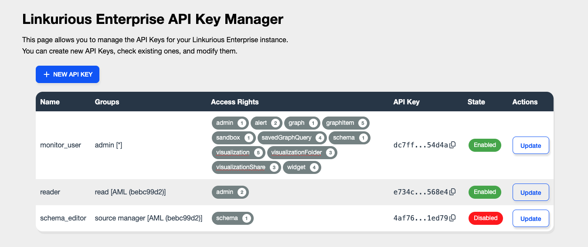
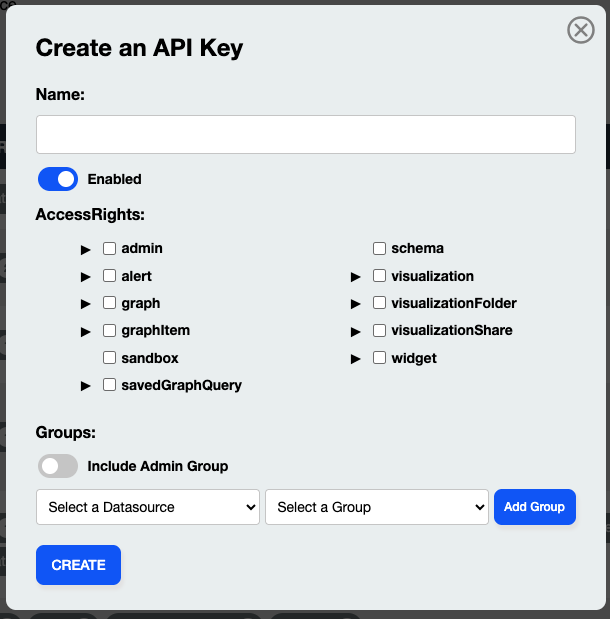
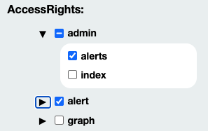
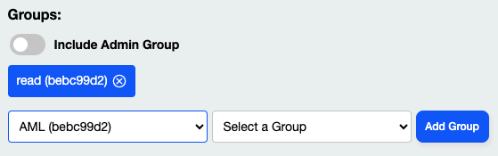

<!-- omit in toc -->
# API Key Manager [plugin for Linkurious Enterprise](https://doc.linkurious.com/admin-manual/latest/plugins/)

<!-- auto generated with https://marketplace.visualstudio.com/items?itemName=yzhang.markdown-all-in-one -->
<!-- omit in toc -->
## Table of contents
- [Compatibility](#compatibility)
- [Configurations](#configurations)
- [URL Parameters](#url-parameters)
- [User Manual](#user-manual)
  - [Review an API Key](#review-an-api-key)
  - [Create an API Key](#create-an-api-key)
  - [Edit an API Key](#edit-an-api-key)
- [Licensing](#licensing)
  
# Compatibility

This plugin is compatible with Linkurious Enterprise starting from v4.3.0.

# Configurations

This plugin does not require any additional configuration parameter.

# URL Parameters

The plugin can be accessed from its home page without the need to specify any URL parameter.

# User Manual

This plugin allows you to manage the [API Keys](https://doc.linkurious.com/server-sdk/latest/use-the-api-key/) that are registered with your Linkurious Enterprise instance.

With a default configuration, it is possible to access the plugin under the `/plugins/api-key-manager/` path (e.g. `http://127.0.0.1:3000/plugins/api-key-manager/`).

Access to the plugin is allowed only to users who are part of the `admin` group (please, refer to [this page](https://doc.linkurious.com/admin-manual/latest/access-control/) for more information on Linkurious Enterprise access control).

The plugin allows the following actions to be performed:

- review exsisting API Keys;
- create a new API Key;
- edit an existing API Keys.

## Review an API Key

All the existing API Keys are enlisted in the main page of the plugin.

For each API Key, it's possible to check:
- the *name* associated to it;
- the *group(s)* the groups that it will impersonate;
- the list of available *Access Rights*, which are grouped by category. Each category displays the category name and a badge showing the total number of enabled access rights. Hovering over a category displays a tooltip with more information;  

- the actual *API Key*: it can be easily copied by simply clicking on it;
- its *state*: whether is enabled or not,

An *Update* button is also available to modify the selected API key.

## Create an API Key

By clicking on the `+ NEW API KEY` button in the main page, it will be possible to create a new API Key via a form.

To create an API Key:
- `Name`: enter a name to identify the API key;
- `Enabled`: whether the API key will be active immediately after creation;
- `Access Rights`: select the access rights to assign to the API key. Clicking on a category selects all access rights within that category. For more granular control, expand the category and select the individual access rights you want to grant;  

- `Groups`: define the groups that the API key can impersonate by selecting the appropriate datasource and group. You can add multiple groups if needed.  

Once these fields are configured, click `CREATE` to generate the API Key.

Any errors and/or invalid values will be shown in the form.

##  Edit an API Key

An `Update` button is present on each row of the API Keys table.
By clicking on it, it's possible to edit the permissions of the selected API Key

A pre-filled form identical to the one for creating an API Key will be displayed.

# Licensing

The `API Key Manager` is licensed under the Apache License, Version 2.0. See [LICENSE](/LICENSE) for the full license text.
